<div align="center">

# UI Anatomy

Learn UI component names by hovering a live wireframe mockup

[![Live][badge-site]][url-site]
[![HTML5][badge-html]][url-html]
[![CSS3][badge-css]][url-css]
[![JavaScript][badge-js]][url-js]
[![Claude Code][badge-claude]][url-claude]
[![License][badge-license]](LICENSE)

[badge-site]:    https://img.shields.io/badge/live_site-0063e5?style=for-the-badge&logo=googlechrome&logoColor=white
[badge-html]:    https://img.shields.io/badge/HTML5-E34F26?style=for-the-badge&logo=html5&logoColor=white
[badge-css]:     https://img.shields.io/badge/CSS3-1572B6?style=for-the-badge&logo=css3&logoColor=white
[badge-js]:      https://img.shields.io/badge/JavaScript-F7DF1E?style=for-the-badge&logo=javascript&logoColor=black
[badge-claude]:  https://img.shields.io/badge/Claude_Code-CC785C?style=for-the-badge&logo=anthropic&logoColor=white
[badge-license]: https://img.shields.io/badge/license-MIT-404040?style=for-the-badge

[url-site]:   https://anatomy.neorgon.com/
[url-html]:   #
[url-css]:    #
[url-js]:     #
[url-claude]: https://claude.ai/code

</div>

---

## Overview

UI Anatomy is an interactive wireframe simulator where hovering any part of a white-outline website mockup reveals the component's name, alternate names, design variants, and a ready-to-use AI prompt tip. It helps developers, designers, and anyone working with AI tools build better prompts by teaching them the vocabulary of UI components.

Five mockup layouts cover the most common site types: Landing Page, Corporate, Startup, Portfolio, and Blog -- each with 15--25 unique hoverable components.

**Live:** anatomy.neorgon.com

---

## Features

- **5 wireframe layouts** -- Landing Page, Corporate, Startup, Portfolio, Blog; switch with tabs
- **40+ component definitions** -- name, alternate names, description, variants, and prompt tip per component
- **Hover to identify** -- hover any element in the mockup to see its full component profile in a tooltip
- **Component browser** -- searchable sidebar listing all components in the active layout by category
- **Show outlines mode** -- toggle to reveal all component boundaries at once for quick scanning
- **Bidirectional sync** -- hovering a component highlights it in the browser; clicking a browser item scrolls to and highlights it in the mockup
- **Prompt tips** -- every component includes a copy-ready example prompt phrase to use with AI design tools

---

## Running locally

ES modules require an HTTP server (not `file://`):

```bash
make serve
# or
python3 -m http.server 8820
```

Then open [http://localhost:8820](http://localhost:8820).

---

## Architecture



```
anatomy-site/
├── index.html              # App shell (~90 lines)
├── css/
│   └── style.css           # All styles: Neorgon dark theme + wireframe elements
├── js/
│   ├── app.js              # Entry point, wires up render + events
│   ├── state.js            # Active layout, hovered comp, toggles
│   ├── data.js             # 40+ component definitions + layout component lists
│   ├── layouts.js          # 5 wireframe HTML template functions
│   ├── render.js           # renderTabs, renderMockup, renderBrowser, tooltip
│   ├── events.js           # Hover, click, search, outlines + browser toggles
│   └── utils.js            # debounce, escHtml
├── docs/
│   ├── architecture.mmd    # Mermaid source
│   └── architecture.svg    # Generated diagram
├── favicon.ico
├── energon-classic-logo.png
├── CNAME                   # anatomy.neorgon.com
├── Makefile                # make serve (port 8820), make kill
├── robots.txt
└── sitemap.xml
```

---

<div align="center">
<sub>Part of <a href="https://neorgon.com/">Neorgon</a></sub>
</div>
